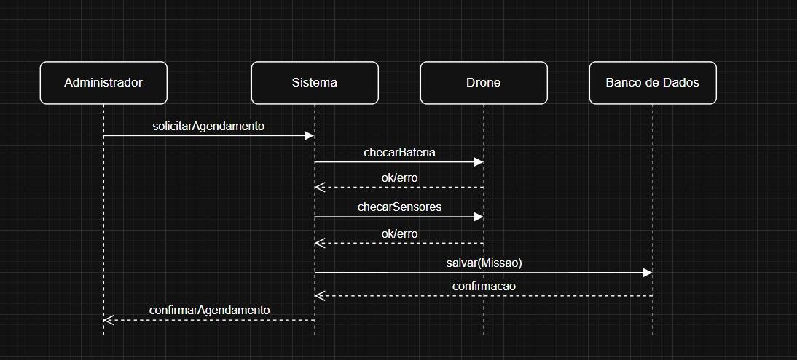

# Etapa 3 – Diagrama de Sequência Inicial

Nesta etapa foi criado o **diagrama de sequência UML** referente ao caso de uso **Agendar Missão**.

---

## 📌 Diagrama de Sequência

---

## 📌 Fluxo da Interação

1. **Administrador → Sistema**: solicita agendamento de missão.  
2. **Sistema → Drone**: checa bateria e sensores.  
3. **Drone → Sistema**: retorna resultados das verificações.  
4. **Sistema → Banco de Dados**: salva missão agendada.  
5. **Banco de Dados → Sistema**: confirma operação.  
6. **Sistema → Administrador**: retorna confirmação do agendamento.

---

## 📌 Observações

- Foram usadas **setas sólidas** para chamadas síncronas.  
- Foram usadas **setas tracejadas** para retornos.  
- É possível incluir um fragmento `alt` para representar cenários de erro (bateria insuficiente, sensores inoperantes ou conflito de missão).
